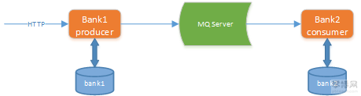

#1.RocketMQ实现可靠消息最终一致性事务
###1.1业务说明
  - 本实例通过RocketMQ中间件实现可靠消息最终一致性分布式事务，模拟两个账户的转账交易过程。
  - 两个账户在分别在不同的银行(张三在bank1、李四在bank2)，bank1、bank2是两个微服务。交易过程是，张三给李四转账指定金额。
  - 上述交易步骤，张三扣减金额与给bank2发转账消息，两个操作必须是一个整体性的事务。
  

###1.2程序组成部分
本示例程序组成部分如下：

 - 数据库：MySQL-5.7.25
    * 包括bank1和bank2两个数据库。
- JDK：64位 jdk1.8.0_201

- rocketmq 服务端：RocketMQ-4.5.0

- rocketmq 客户端：RocketMQ-Spring-Boot-starter.2.0.2-RELEASE

- 微服务框架：spring-boot-2.1.3、spring-cloud-Greenwich.RELEASE

- 微服务及数据库的关系 ：
    * demo-bank1 银行1，操作张三账户， 连接数据库bank1
    * demo-bank2 银行2，操作李四账户，连接数据库bank2
####本示例程序技术架构如下：

####交互流程如下：
1. Bank1向MQ Server发送转账消息
2. Bank1执行本地事务，扣减金额
3. Bank2接收消息，执行本地事务，添加金额
